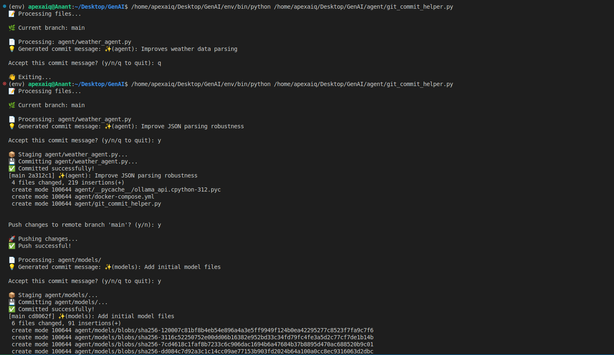

Assigment 2 : AI agents

1] git commit helper
- Scans unstaged files
- Staged them 
- Generate a commit message 
- makes a commit with this commit messages by taking confirmation from user
- pushes the commit to remote branch

- 

---
2] Coding assistant
- Safely parses JSON from model responses
- can do 4 tasks based on tooling : "create_file", "run_command", "install_package", "read_file"
- followsStep-by-Step Processing:
    - Plan: The assistant first plans what needs to be done
    - Action: Executes actions using available tools
    - Output: Provides final response to the user
    - Observe: Monitors results of actions
- DO not let user run sudo commands 

- 